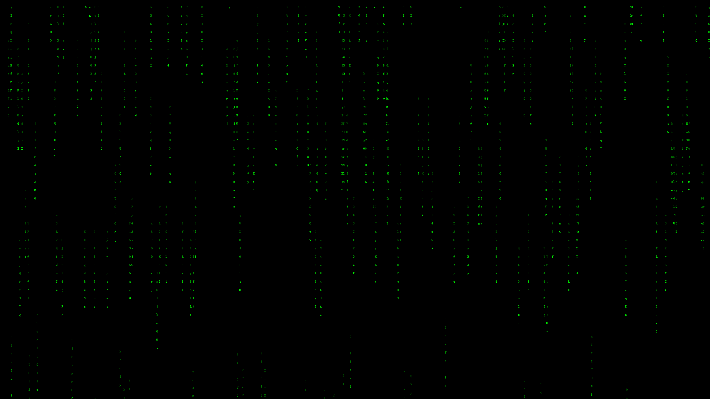

# Qt代码实现屏保程序: 黑客帝国-代码雨

## 效果图如下

## 实现思路

1 构建一个无边框窗口, 并设置为黑色背景

2 在窗口类中添加成员变量, 存放若干串雨滴, 每个雨滴又包含起始点和字串信息

3 在窗口类的构造函数中先初始化所有雨滴, 并启动一个定时器来update()以调用paintEvent()重绘画面

4 在paintEvent()中先刷新雨滴下次的位置, 然后通过drawText()把雨滴的字串信息逐个打印上去, 注意要把画笔Qpen的颜色设置渐浅

5 最后重写mouseMoveEvent(), 实现鼠标移动后程序自动退出

